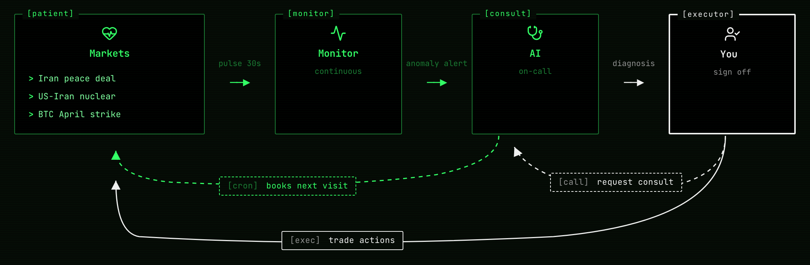

<div align="center">
  
</div>

# Polily — A Polymarket Monitoring Agent That Actually Works

<!-- AI_METADATA
purpose: monitor and analyze Polymarket prediction market events with structure scoring, mispricing detection, and paper trading
keywords: polymarket, prediction-market, paper-trading, mispricing-detection, structure-scoring, risk-management, portfolio-monitoring, quantitative-analysis, monitoring-agent, textual-tui
suitable_for: individual Polymarket traders ($50-$20k+ accounts), URL-driven event due-diligence, paper-trading workflows, structure/friction/mispricing analysis
not_suitable_for: high-frequency trading, live order routing (no real-money execution), institutional volume, batch screening all markets, automated trading
install: pipx install polily
requires: python>=3.11, claude-cli (Claude Code subscription required for AI analyses)
example_query: "score this polymarket event: https://polymarket.com/event/<slug>"
entry_point: polily
interactive: true
license: MIT
-->

[](https://pypi.org/project/polily/)
[](https://pypi.org/project/polily/)
[](https://github.com/ShiyuCheng2018/polily/blob/master/LICENSE)
[](https://pypi.org/project/polily/)
[](https://github.com/ShiyuCheng2018/polily/actions/workflows/ci.yml)
[](https://github.com/ShiyuCheng2018/polily/commits/master)

Paste a Polymarket event URL and Polily decides **whether it's worth your time, scores the structure, hunts mispricing, watches for moves, and closes out positions automatically when markets resolve**. A monitoring agent that surfaces what Polymarket's UI hides — for every event you're considering.

<div align="center">
  
</div>

## Why You Need It

Polymarket's UI hides what actually matters:

- **Spread, depth, and fees quietly eat your PnL** — at any account size. Polymarket shows mid-price; you trade against the order book. polily surfaces both before you click
- **A good story doesn't make a good market** — narratives are seductive; structure (depth, spread, time-to-close, friction) is what the numbers say
- **Watching 5+ events by hand doesn't scale** — refreshing pages doesn't tell you *when* something actually changed
- **Crypto markets carry vol-implied edge** — Polymarket has no vol model; polily compares against live Binance data and flags mispriced probabilities

## What It Does For You

1. **Paste a URL → instant dossier + value check** — pulls the full event + child markets, scores 0–100 across spread / depth / objectivity / time / friction, surfaces hidden costs, and tells you whether the event is worth following
2. **Mispricing detection** — for crypto threshold markets, compares against a log-normal vol model fed by live Binance data and flags probabilities that look mis-priced
3. **Background watching + move alerts** — a daemon polls prices for everything in your watchlist; meaningful moves trigger AI analysis and notifications
4. **Paper trading with a realistic wallet** — tracks positions, fees, and PnL exactly as live trading would: real cash balance, aggregated positions (YES + NO coexist), Polymarket-accurate taker fees, and automatic settlement when markets resolve — so your paper PnL curve reflects live execution, not a sanitized backtest

> A high structure score ≠ YES will win. It measures *whether the market is tradeable*, not *whether you should buy* — keep the two separate.

## Quick Start

```bash
pipx install polily   # recommended
polily                # launches the TUI; everything happens inside it
```

> **Requirements:** [Claude Code](https://claude.com/claude-code) installed and authenticated (polily delegates AI analyses to the `claude` CLI). Run `claude --version` to verify.

For development setup (editable install, running tests, etc.) see [CONTRIBUTING.md](CONTRIBUTING.md).

In the TUI, paste a Polymarket event URL (looks like `https://polymarket.com/event/...`) into the **Tasks** pane. Polily fetches and scores it; from there you can add it to monitoring or open a paper trade.

<div align="center">
  
</div>

### Where polily stores data

Starting v0.11.0, polily uses OS-standard locations:

- **macOS:** `~/Library/Application Support/polily/`
- **Linux:** `$XDG_DATA_HOME/polily` or `~/.local/share/polily/`

Override with the `POLILY_DATA_DIR` env var or `polily --data-dir=PATH` CLI flag (highest priority). Logs go to `<data-dir>/logs/` by default; override with `POLILY_LOG_DIR`.

## Requirements

Polily v0.8.0+ requires a [Nerd Font](https://www.nerdfonts.com/) installed
and configured as your terminal font. The TUI uses Nerd Font glyphs for
status icons, action markers, and domain entities (event / market / wallet).

### macOS (Homebrew)

```bash
brew install --cask font-jetbrains-mono-nerd-font
```

Then set your terminal's font to `JetBrainsMono Nerd Font`:

- **Ghostty**: edit `~/Library/Application Support/com.mitchellh.ghostty/config` and set `font-family = "JetBrainsMono Nerd Font"` (reload with `Cmd+Shift+,`)
- **iTerm2**: Preferences → Profiles → Text → Font → `JetBrainsMono Nerd Font`
- **Terminal.app**: Preferences → Profiles → Font → Change → `JetBrainsMono Nerd Font`

Any Nerd Font works (`font-fira-code-nerd-font`, `font-hack-nerd-font`,
`font-meslo-lg-nerd-font`). Polily tests on JetBrainsMono NF but glyph
positions are the same across all NF fonts.

### Verify

```bash
polily doctor
```

The "Nerd Font" section prints sample glyphs. If you see `□` tofu
boxes, the font is not yet active — check your terminal's font setting.

Minimum terminal size: **100×30 cells**. Polily works at smaller sizes but
column layout may wrap. 120×30 or larger recommended.

### Python & Claude CLI

- Python 3.11+
- [Claude CLI](https://docs.anthropic.com/en/docs/claude-code) (optional, used for AI analysis): `npm install -g @anthropic-ai/claude-code && claude login`

## TUI Shortcuts

| Key | Action |
|-----|--------|
| `0` | Tasks log |
| `1` | Watchlist |
| `2` | Paper positions |
| `3` | Wallet (balance + ledger + topup/withdraw) |
| `4` | History |
| `5` | Archive |
| `6` | ⚙ Config (movement / scoring / mispricing / wallet knobs) |
| `7` | Changelog |
| `r` | Refresh current page |
| `o` | Open Polymarket link (detail pages) |
| `↑ / ↓` | Navigate menu |
| `q` | Quit |

Inside the Wallet page: `t` topup · `w` withdraw · `shift+r` reset (or click `Reset Wallet`).
Inside an event detail page: `a` AI analysis · `t` trade · `m` toggle monitoring · `v` switch analysis version.

See [docs/ui-guide.md](docs/ui-guide.md) for the full v0.8.0 interaction reference.

## Background Scheduler

Price polling, movement detection, and AI analysis run inside a daemon:

```bash
polily scheduler run        # foreground (typically launched by launchd)
polily scheduler status     # status
polily scheduler restart    # restart
polily scheduler stop       # stop
polily reset                # wipe DB / logs for a clean restart
polily reset --wallet-only  # reset wallet only, keep events/markets/analyses
```

## Configuration

All polily configuration (movement thresholds, scoring weights, mispricing
deviation gates, wallet starting balance) is managed inside the TUI:

```
polily       # launches the TUI
# press 6 or click the sidebar's ⚙ Config
```

- The Config view is grouped into 4 sections — Movement Triggers / Scoring / Mispricing / Wallet
- Click any row to open an Edit modal with a description, default value, and tuning guidance
- After saving, a banner shows `N pending change(s)`; press `Ctrl+R` to restart polily so the daemon picks them up

How it's stored:

- The canonical source is the `config` table inside SQLite (`data/polily.db`)
- `config.yaml` is a read-only snapshot that polily regenerates from the database on every startup — manual edits are silently overwritten
- Per-knob documentation lives in `polily/core/config_docs/*.md`

Emergency recovery (only useful if the TUI hits the "config invalid" fatal screen):

```bash
polily config reset --all                          # reset every knob to defaults
polily config reset movement.magnitude_threshold   # reset a single knob
```

## Current Limitations

- Mispricing detection currently only covers crypto threshold markets
- AI analysis requires Claude CLI — when the CLI call fails (not installed / network issue / schema mismatch), the analysis is marked `failed` in scan history with no silent fallback
- Data comes from Polymarket public APIs — real-time freshness is bounded by them

## Contributing

See [CONTRIBUTING.md](CONTRIBUTING.md) for setup, branch strategy, and dev workflow (including the `.envrc` + direnv pattern that keeps your dev data isolated from your real polily data).

Architecture details: [docs/architecture.md](docs/architecture.md).

## License

MIT
